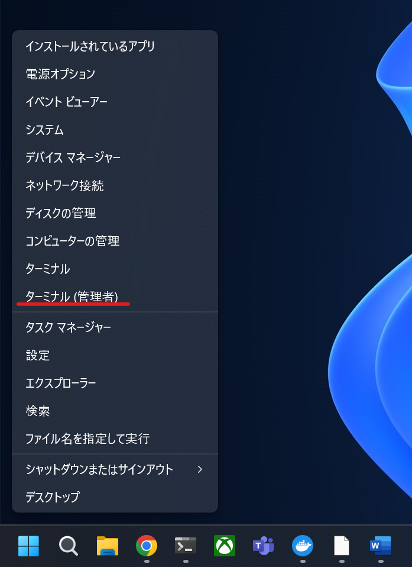
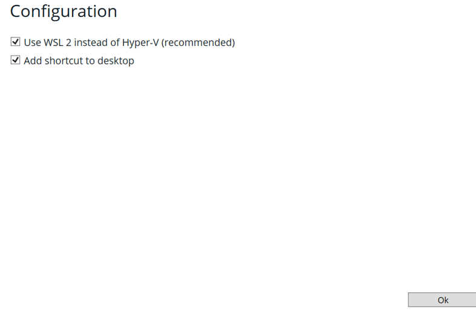
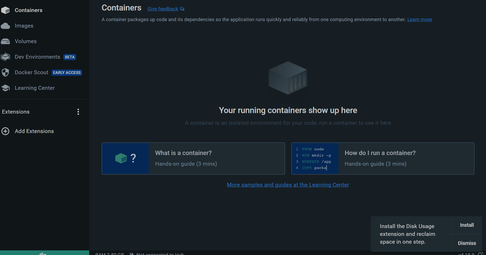
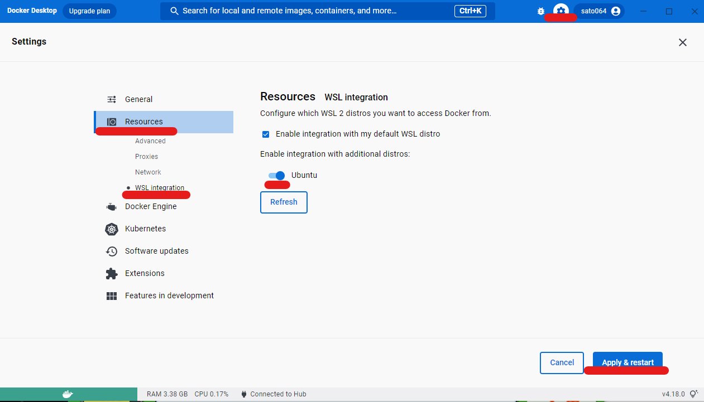
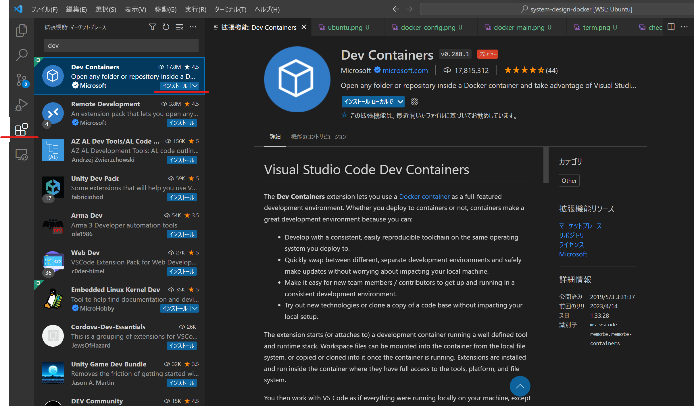
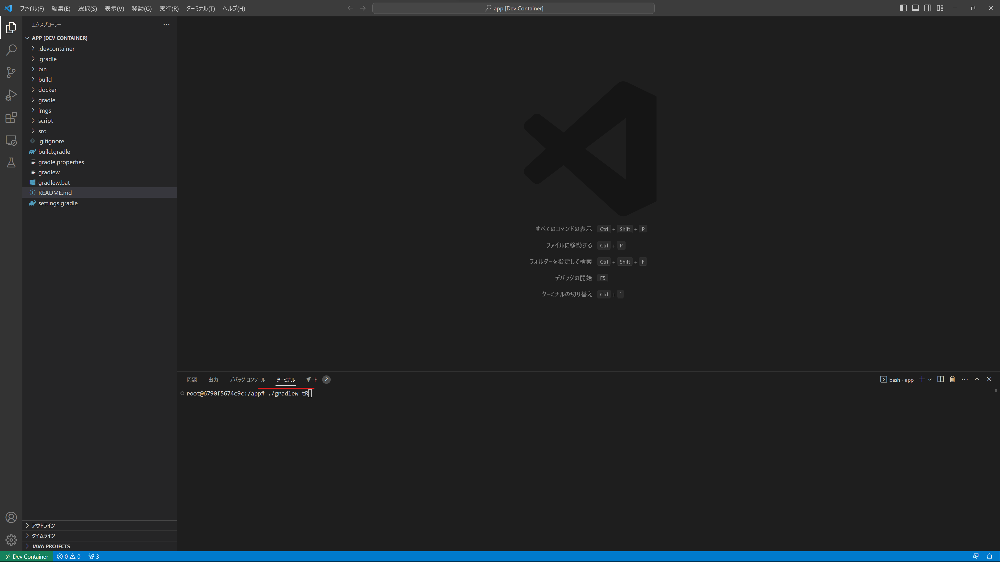
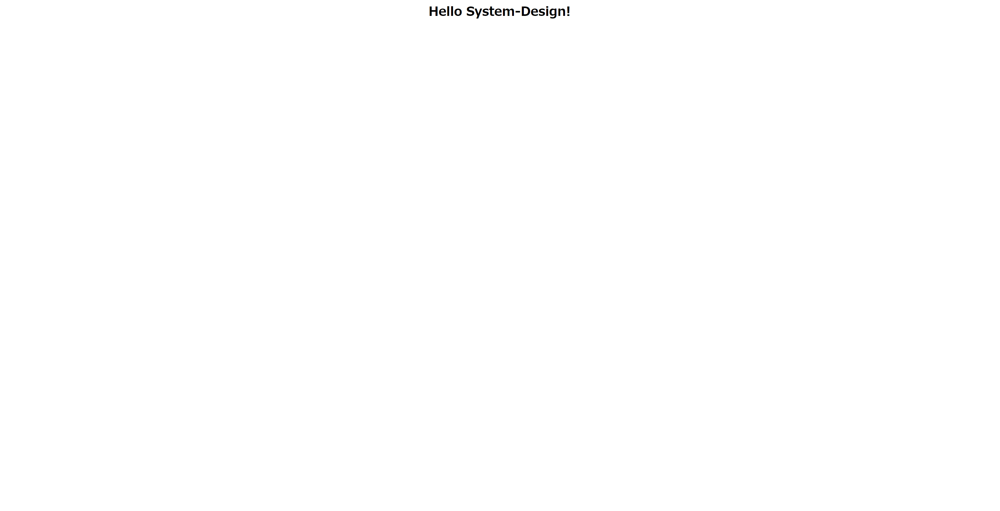

# System-Design-Docker

授業『システム設計』環境構築のためのレポジトリ

## Windowsユーザ向け環境構築方法
以下のすべての手順を実行してください．

### STEP-1 WSL,VSCodeのインストール

手順1 windowsボタンを右クリックして，ターミナル(またはpower shell)を管理者権限で起動


手順2 以下のコマンドを1行づつコピーして実行
```
Set-ExecutionPolicy RemoteSigned -scope CurrentUser
iwr -useb https://raw.githubusercontent.com/HazeyamaLab/system-design-docker/master/script/install.ps1 | iex
```
1行目を実行すると以下のように聞かれるので，Yを入力してEnterで同意  
```
実行ポリシーの変更
実行ポリシーは、信頼されていないスクリプトからの保護に役立ちます。実行ポリシーを変更すると、about_Execution_Policies
のヘルプ トピック (https://go.microsoft.com/fwlink/?LinkID=135170)
で説明されているセキュリティ上の危険にさらされる可能性があります。実行ポリシーを変更しますか?
[Y] はい(Y)  [A] すべて続行(A)  [N] いいえ(N)  [L] すべて無視(L)  [S] 中断(S)  [?] ヘルプ (既定値は "N"): Y
```

手順3 Ubuntu というCLIが立ち上がり，ユーザ名とパスワードの設定が求められるので設定．このとき __パスワードは入力しても画面上に表示されないので要注意！__


以上でSTEP-1完了．

### STEP-2 Docker-Desktopのインストール
  
手順1 Docker Desktopのダウンロード・インストール
  
https://www.docker.com/products/docker-desktop/ にアクセス，ダウンロードしたexeファイルを実行．
  
チェックボックスはどちらもチェックが入っていることを確認．（バージョンによってはチェックボックスが1つしかないこともあるが，それでも大丈夫） 
  
規約に同意したらAcceptボタンでインストール．
  
インストールできたらDocker-Desktopを起動し，チュートリアルをスキップすると，このようなメイン画面が出現．
  
  
手順2 Dockerの設定  
WSL上でDockerが動作するように設定する．
Docker-Desktopのメイン画面左上の矢印マークを押して設定画面を開き，右側のResourcesタブからWSL integrationを選択し，Ubuntuのチェックを入れて右下のApply & restartを押下．
  

以上でSTEP-2は完了．

### STEP-3 Ubuntu上での環境整備  
  手順1
Ubuntuを起動し，CLIが立ち上がるのを確認する．
  
  
手順2
Ubuntu CLIで以下のコマンドを実行．
```
curl -sf https://raw.githubusercontent.com/HazeyamaLab/system-design-docker/master/script/setup.sh | sh -s
```
パスワードが求められるので．STEP-1 手順3で入力したパスワードを入力．
  
手順3
VSCodeが立ち上がるので，左のテトリスのようなアイコンを選択し，Dev Containerの拡張機能を検索欄から検索してインストール．
  
  
手順4
右下に以下のようなWindowが出現するので，Reopen in Containerを選択 __このとき8080，8081，3307のポートが使われていると正常に起動しない，特にローカルにMySQLがインストールされている場合は要注意__
  
  
手順5  
初回起動時は特に時間がかかるのでしばらく待機．その後，画面下部ターミナルで以下のコマンドを実行．もしターミナルが表示されていなければ，上部メニューバーの ターミナル -> 新しいターミナル で出現する．
```
./gradlew tR
```
  
  
手順6  
```
> Task :tomcatRun
Started Tomcat Server
The Server is running at http://localhost:8080/system-design-dev
```
以上の出力を確認した後，
http://localhost:8080/system-design-dev にアクセスし下の画面が出現すれば環境構築は終了．
お疲れ様でした．
